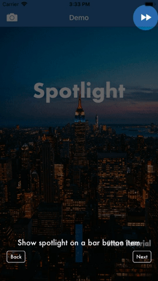

# Spotlight
Introductory walkthrough framework for iOS Apps (inspired by [Gecco](https://github.com/yukiasai/Gecco), Rewrite to make it simpler)

You built your app, added many features and are now ready to showcase it to the world. But what if consumers are having some difficulty navigating/using the app, or understanding some features? At some point release notes won't cut it. Screenshots of the app with arrows and info might help, but what would really help is to highlight individual parts of the app and give them a little context. Without taking much of their time. Now that's where Spotlight shines. You worry about building that fancy new feature, and let Spotlight handle the user education part. Decide at run time what to highlight, without compromising design and version testing capability. Checkout details on how to integrate Spotlight and never skip user education because it is ~~hard~~ not hard.




## Usage

Setting up Spotlight is really simple and takes only a few lines of code. There are convenience initializers for views and bar buttons and more choices.

``` swift
import LRSpotlight // Cocoapods
OR
import Spotlight // Carthage

class ViewController: UIViewController {

    override func viewDidAppear(_ animated: Bool) {
        super.viewDidAppear(animated)
        startIntro()
    }

    func startIntro() {
        let nodes = [SpotlightNode(text: "Show Spotlight on a Bar button item", target: .barButton(navigationItem.rightBarButtonItem)),
                     SpotlightNode(text: "Show Spotlight on a View", target: .view(nameLabel)),
                     SpotlightNode(text: "Show Spotlight at a point location", target: .point(CGPoint(x: 100, y: 100), radius: 50)),
                     SpotlightNode(text: "Show Spotlight on the first tab bar item", target: .tabBarItem(tabBarController, 0)),
                     SpotlightNode(text: "Show Spotlight over a rectangle", target: .rect(redView.bounds))]

            Spotlight().startIntro(from: self, withNodes: nodes)
    }
}

```

Adopt ```SpotlightDelegate``` protocol to get a callback when each node is displayed and when spotlight goes offscreen.

```swift
public protocol SpotlightDelegate: class {
    func didAdvance(to: Int, of total: Int)
    func didDismiss()
}
```

## Installation

#### CocoaPods

```
pod 'LRSpotlight'
```
#### Carthage

```
github "lekshmiraveendranath/Spotlight"
```

### Configurations
```swift
// Delay between spotlights (defaults to 3 seconds)
Spotlight.delay = 5.0
// Animation duration for spotlight appearance (Defaults to 0.25 seconds)
Spotlight.animationDuration = 0.1
// Alpha of the Spotlight overlay (defaults to 0.6)
Spotlight.alpha = 0.8
// Background color of the Spotlight view (defaults to black)
Spotlight.backgroundColor = .grey
// Text color inside the info view (defaults to white)
Spotlight.textColor = .green
// Font used inside the info view (defaults to Futura 18pt)
Spotlight.font = UIFont(name: "Lato", size: 18)!
// Display a background for the info text view (defaults to true)
Spotlight.showInfoBackground = true
// The info overlay has a blur effect to make it stand out and be readable across the board (defaults to light)
Spotlight.infoBackgroundEffect = .dark
// Change back and next button titles
Spotlight.backButtonTitle = "atrás"
Spotlight.nextButtonTitle = "siguiente"
```


## Features

- [x] Easy to integrate, just few lines of code
- [x] Code based Spotlights, no need for an additional storyboard scene per screen for laying out text
- [x] Timer based automatic forwarding (configurable)
- [x] Convenience initializers for views, bar buttons, tab bar items, plus spotlights using points or rects
- [x] Compatible with UI Version testing, since Spotlights are displayed over UI elements at runtime
- [x] Swift 4.2
- [x] Sensible defaults, configurable
